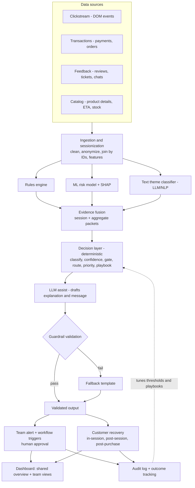

# AI-Powered Customer Journey Friction Detection and Recovery Assistant

**Domain:** Retail / E-commerce · **Problem Statement 4**
**Document:** PRD + System Architecture (final agreed design)

---

## 1. One-line summary

Rules and ML **find** friction, deterministic logic **decides** what to do, the LLM only **explains** (under guardrails), and humans on business teams **approve** — turning "70% of carts are abandoned" into "who is leaving, why, and what to do about it."

---

## 2. Problem

E-commerce customers abandon purchases because of hidden friction: unclear product information, delivery uncertainty, payment failures, poor recommendations, and post-purchase concerns.

- Businesses see **where** drop-offs happen (funnel reports) but not **why**, or **what action** to take.
- Customer service, marketing, product and operations analyze their slices **separately** — nobody connects the signals.
- Result: revenue loss, higher support volume, lower loyalty, poor brand perception.

**Gap in existing tools** (Contentsquare, Quantum Metric, FullStory, Glassbox, Amplitude): strong at *where/when* from click behavior; weak at *why*, because they rarely fuse clicks with payments, orders, tickets, reviews and catalog data, and rarely drive team-level recovery workflows.

---

## 3. Goals, non-goals, success metrics

### Goals
1. **Detect** customer journey friction points (session-level and aggregate-level).
2. **Infer likely causes**, with explanations that connect customer behavior to business causes.
3. **Recommend practical recovery actions** for customers and business teams.
4. Provide **journey risk indicators, recommended interventions, assisted responses, and workflow triggers**.

### Non-goals (MVP)
- Production-scale streaming infrastructure.
- Full session video replay for every session.
- Autonomous LLM decision-making (explicitly excluded by design).

### Success metrics
| Metric | Target (MVP, on synthetic data) |
|---|---|
| Friction detection accuracy vs planted ground truth | Precision / recall per friction type reported |
| Cause classification accuracy | % of sessions assigned the correct friction type |
| Recovery lift vs holdout group | % of at-risk carts recovered |
| Explanation grounding pass rate | % of LLM outputs passing validation |
| Alert quality | % of alerts at high confidence; false-alert rate |

---

## 4. Users

| User | Needs |
|---|---|
| **Customer service** | At-risk customers, post-purchase issues, AI-drafted replies to approve |
| **Marketing** | Abandoned carts by cause, recovery campaign performance, recommendation performance |
| **Product** | Products with information gaps, UX problems, comparison loops |
| **Operations / Tech** | Delivery-driven drop-off by region/courier, payment gateway health, technical errors |
| **End customer** (indirect) | Timely, relevant help that removes the reason they were stuck |

---

## 5. Friction taxonomy

### 5.1 Core friction points (from the problem statement — priority 1)

| # | Friction | Detect (behavior signals) | Likely business cause | Customer recovery | Owner team |
|---|---|---|---|---|---|
| 1 | **Unclear product information** | Comparison looping, repeated size-chart/spec opens, review scanning then exit, "not as described" returns | Missing/vague attributes; repeated unanswered Q&A | Auto comparison table, fit recommendation, AI Q&A from specs/reviews | Product |
| 2 | **Delivery uncertainty** | Hesitation on delivery step, repeated pincode checks, exit after ETA/fee shown, "will it arrive by…" chats | Long ETA for region, late fee reveal, slow courier, far warehouse | Guaranteed "arrives by" date, express option, show fees early | Operations |
| 3 | **Payment failures** | Multiple failed attempts, method switching, exit after failure, "money deducted" tickets | Gateway/bank/method instability; trust hesitation | Suggest a working alternate method, one-tap retry link, refund reassurance | Operations / Tech |
| 4 | **Poor recommendations** | Ignored recommendation slots, repeated reformulated searches, zero-result searches | Generic recs, out-of-stock recs, search/catalog gaps | Session-based recs, in-stock alternatives, guided assistant | Marketing |
| 5 | **Post-purchase concerns** | Repeated tracking checks, "where is my order" tickets, cancellations/returns, negative reviews | Stale tracking, uncommunicated delays, slow refunds, quality issues | Proactive delay alerts, assisted replies, easy returns | Customer service |

> Cart abandonment and product comparison behavior are **symptoms** through which these causes appear, not separate friction types.

### 5.2 Extended friction points (MVP bonus coverage)

| # | Friction | Detect | Customer recovery | Owner team |
|---|---|---|---|---|
| 6 | **Hidden costs / price shock** | Exit right after total shown; checkout → cart back-navigation | Show full cost early; free-shipping threshold nudge | Marketing |
| 7 | **Coupon failure** | Repeated coupon attempts then exit | Auto-apply best valid coupon; explain rejection | Marketing |
| 8 | **Forced login / OTP issues** | Exit at login wall; repeated "resend OTP" | Guest checkout; alternate OTP channel | Customer service |
| 9 | **Out of stock / size unavailable** | Clicks on unavailable sizes, "notify me", exit | Similar in-stock alternatives; back-in-stock alert | Product |
| 10 | **Technical glitches** | Rage clicks, dead clicks, slow loads, JS/API errors | Retry/fallback; immediate tech alert | Operations / Tech |

---

## 6. Design principle: the LLM is not the final authority

**The system and humans decide. The LLM only assists with language, and every output is validated.**

| Task | Decided by | LLM role |
|---|---|---|
| Is there friction? | Rules + ML | None |
| Which friction type? | Deterministic mapping of rules + ML signals + text themes | Classifies **text** into themes only |
| Confidence score | Formula (detector agreement) | None |
| Which team? | Fixed routing table | None |
| Priority | Impact formula | None |
| Recovery action | Playbook lookup (whitelist) | None; cannot choose or invent actions |
| Explanation text | Built from evidence | Drafts wording |
| Customer message | Template + playbook action | Personalizes wording |
| Final approval | Business team (or pre-approved low-risk auto-rules) | None |

---

## 7. System architecture

### 7.1 High-level flow



### 7.2 Layers and components

#### Layer 1 — Data sources
| Source | Content | Captured by |
|---|---|---|
| Clickstream | Page views, clicks, cart actions, hesitation, scroll, rage/dead clicks, errors | Lightweight JS tracker |
| Transactions | Payment attempts, failures, gateway, error codes; order and delivery status | Backend logs |
| Feedback | Reviews, support tickets, chat transcripts | Support/review systems |
| Catalog | Product attributes, delivery ETA, stock, price | Product DB |

**Capture strategy:** structured event tracking as the backbone (not full session replay). Interaction signals (rage clicks, idle time) are computed in the browser and sent as summaries. Optional session replay only for flagged high-friction sessions. **Never capture** typed card numbers, passwords or OTPs.

**MVP:** all sources generated by a **synthetic data generator** with the 10 friction types deliberately planted, so detection accuracy can be measured against ground truth.

#### Layer 2 — Ingestion and sessionization
- Clean and validate events; hash/anonymize user identifiers.
- Sessionize (30-minute inactivity rule) and map each session onto the funnel:
  `Browse → Product → Cart → Checkout → Payment → Order → Post-purchase`
- Join all sources using shared keys: `session_id`, `user_id`, `product_id`, `order_id`.
- Compute derived features:

| Feature | Definition |
|---|---|
| Rage clicks | ≥ 3–4 clicks on the same element within ~2 s |
| Hesitation | Step dwell time z-score vs normal (e.g. > 2) |
| Loops | Repeated patterns like PDP A → PDP B → PDP A, Checkout → Cart → Checkout |
| Retries | Failed payment / coupon / OTP attempts; method switches |
| Info-seeking | Repeated size chart, delivery info, return policy, review opens |
| Error exposure | API errors, slow loads, out-of-stock encounters |
| Step exit rate | Sessions ending at a step ÷ sessions reaching it |

#### Layer 3 — Detection (three detectors, each on the data it suits)
1. **Rules engine** — known, obvious friction; instant, explainable (e.g. "≥ 2 payment failures").
2. **ML risk model** — gradient boosting (XGBoost) on session features predicting abandonment risk; **SHAP** gives the top contributing signals per session. Converter-vs-abandoner comparison at each step drives cause discovery.
3. **Text theme classifier** — LLM/NLP tags reviews, tickets and chats into themes (delivery delay, size confusion, payment trust, missing info, returns).

Plus **aggregate analysis**: funnel exit rates, anomaly detection (e.g. payment failures 4× baseline on one gateway), optional Markov-chain transition analysis to estimate impact of fixing a step.

#### Layer 4 — Evidence fusion
Combines all detector outputs into one **evidence packet** per session, plus **aggregate packets** for patterns across many sessions (see schema §8.2).

#### Layer 5 — Decision layer (fully deterministic)
1. **Friction classification** — fixed mapping from signals + themes to one of 10 friction types.
2. **Confidence score** — detector agreement (rule fired, ML high + SHAP agrees, text supports, aggregate confirms).
3. **Confidence gating**

   | Confidence | Action |
   |---|---|
   | High (≥ 0.8) | Alert team with explanation + workflow triggers ready |
   | Medium (0.5–0.8) | Alert marked "needs review"; no automatic actions |
   | Low (< 0.5) | No alert; logged and monitored |

4. **Routing** — fixed friction → team table (§5).
5. **Priority** — impact score = revenue at risk × customers affected × trend → Critical / High / Normal.
6. **Recovery action** — playbook lookup (approved actions only) for both customer and team.

#### Layer 6 — LLM assist (harnessed)
- **Input:** only the evidence packet + the already-decided friction type and action.
- **Output:** fixed JSON schema (§8.3): summary, behavior observed, likely business cause, evidence used; plus personalized customer message within a template.
- **Not allowed:** choosing actions, changing friction type, adding facts, promising refunds or discounts.

#### Layer 7 — Guardrail validation
| Check | Rule |
|---|---|
| Schema | Valid JSON, all fields present |
| Grounding | Every number and claim must exist in the evidence packet |
| Consistency | Explanation matches the system-decided friction type and action |
| Policy | No unapproved offers, no PII, professional tone, frequency caps, consent |

**On failure:** use a pre-written **fallback template**. The system never depends on the LLM behaving.

#### Layer 8 — Actions
**8a. Team alerts + workflow triggers (aggregate path)**
Alert card contents: friction type, confidence, priority, validated explanation, key evidence, recommended action, and buttons — **Approve · Assign · Create ticket · Dismiss**. Workflows run only after human approval (except pre-approved low-risk actions). Critical alerts push immediately; minor ones go to a daily digest.

**8b. Customer recovery (session path)**
| Moment | Channel | Example |
|---|---|---|
| In-session | Popup, banner, chat assistant | "UPI seems slow — pay by card or COD. Cart saved." |
| Post-session | WhatsApp, SMS, email, push | One-tap retry link, faster delivery available |
| Post-purchase | Notifications, assisted support | Proactive delay alert, refund reassurance |

Rules: fix the cause first — discounts only when the cause is price; frequency caps; opted-in channels only; high-value carts or angry customers go to customer service as AI-drafted replies for human approval.

#### Layer 9 — Dashboard (one platform, role-based views)
One shared source of truth (breaks the team silos the problem statement describes), with filtered views per team.

- **Shared overview:** funnel with drop-off heatmap (journey risk indicators), top frictions ranked by revenue at risk, friction health (normal/rising/critical), recovery performance.
- **Team views:** CS, Marketing, Product, Operations — each shows only owned friction, as *what's happening → why → recommended action → act button*.
- **Live at-risk sessions:** risk score, journey path, reason flagged, recommended action, trigger recovery.

#### Layer 10 — Audit and feedback loop
- Log evidence, confidence, LLM draft, validation result, approver, action executed.
- Track outcomes: customer recovered? step drop-off reduced after fix?
- **Holdout group** (e.g. 10% of at-risk sessions receive no action) to prove real lift.
- Results tune confidence thresholds and playbook action selection.

---

## 8. Data schemas

### 8.1 Event
```json
{
  "session_id": "s_1042",
  "user_id": "u_88_hashed",
  "timestamp": "2026-09-30T11:02:14",
  "event": "payment_failed",
  "page": "checkout_payment",
  "product_id": "p_311",
  "order_id": null,
  "metadata": { "method": "UPI", "gateway": "B", "error": "timeout", "cart_value": 2499 }
}
```

### 8.2 Evidence packet
```json
{
  "session_id": "s_1042",
  "risk_score": 0.82,
  "rule_flags": ["payment_retry_x2"],
  "top_signals": ["upi_timeout", "method_switch"],
  "text_themes": ["money_deducted_concern"],
  "aggregate_context": { "gateway_b_failure_rate_multiplier": 4.0, "affected_sessions": 2000 },
  "friction_type": "payment_failure",
  "confidence": 0.92,
  "priority": "critical",
  "owner_team": "operations_tech",
  "playbook_action": { "customer": "alternate_method_and_retry_link", "team": "check_or_switch_gateway" }
}
```

### 8.3 LLM output (validated)
```json
{
  "summary": "Payment-step drop-off rose sharply due to UPI timeouts on Gateway B.",
  "behavior_observed": "Two failed UPI attempts followed by exit.",
  "likely_business_cause": "Gateway B instability, not price.",
  "evidence_used": ["upi_timeout", "gateway_b_failure_rate_multiplier", "affected_sessions"]
}
```

### 8.4 Team alert
```
CRITICAL — Payment failure (confidence 0.92) → Operations/Tech
Payment-step drop-off rose from 8% to 19% in the last hour. 90% of failures are
UPI timeouts on Gateway B, affecting ~2,000 sessions (₹4.2L cart value).
Recommended: Route UPI traffic to Gateway A; send retry links to affected customers.
[Approve] [Assign] [Create ticket] [Dismiss]
```

---

## 9. What we are building (MVP deliverables)

1. **Synthetic data generator** — sessions, payments, orders, reviews, tickets, catalog with 10 planted friction types and ground-truth labels.
2. **Mock storefront** — small store page with the JS event tracker, used to act out friction live in the demo.
3. **Ingestion + feature pipeline** — sessionization, funnel mapping, feature computation.
4. **Detection engine** — rules, XGBoost + SHAP risk model, text theme classifier, aggregate anomaly detection.
5. **Evidence fusion + decision layer** — classification, confidence, gating, routing, priority, playbooks.
6. **Harnessed LLM service** — explanation and message drafting, schema output, guardrail validator, fallback templates.
7. **Action services** — team alerts with workflow triggers; customer recovery messaging.
8. **Dashboard** — shared overview, four team views, live at-risk sessions, recovery performance.
9. **Audit + evaluation** — decision logs, holdout comparison, detection accuracy report.

---

## 10. Tech stack

| Area | Choice |
|---|---|
| Data generation | Python, pandas, Faker |
| Backend / APIs | FastAPI |
| Storage | PostgreSQL (SQLite acceptable for hackathon) |
| ML | XGBoost, SHAP, scikit-learn |
| NLP / LLM | LLM API for text themes, explanation and message drafting; Pydantic for schema validation |
| Frontend | React (Streamlit if time-constrained) |
| Tracker | Lightweight vanilla JS on the mock storefront |

---

## 11. Demo flow

1. **Journey overview** — funnel heatmap, top frictions by revenue lost.
2. **Live friction** — on the mock storefront, fail a payment twice.
3. **Detection** — session appears in live at-risk feed with risk score and friction type.
4. **Root cause** — explanation card linking behavior to Gateway B spike, with evidence.
5. **Team alert** — Operations/Tech alert with Approve / Assign / Create ticket.
6. **Customer recovery** — alternate-payment nudge and retry message preview.
7. **Impact** — detection accuracy vs planted ground truth; recovered carts vs holdout.

---

## 12. Problem statement coverage

| Problem statement asks for | Covered by |
|---|---|
| Detect journey friction | Layers 2–3 |
| Infer likely causes | Layers 3–5 |
| Explanations connecting behavior to business causes | Layers 6–7 |
| Practical recovery actions | Layer 5 playbooks, Layer 8 |
| Journey risk indicators | Priority scoring, dashboard overview |
| Recommended interventions | Playbook actions in alerts and team views |
| Assisted responses | Customer recovery + AI-drafted CS replies |
| Workflow triggers | Team alerts with approval buttons |
| Combine behavior, transactions, feedback, product metadata, service interactions | Layers 1–2 joins, Layer 4 fusion |
| Sessionize, anonymize, classify feedback, clean sequences | Layer 2, text classifier |
| Synthetic data for abandonment, comparison, payment issues, recovery | Synthetic data generator |
| Improve conversion, reduce abandonment, proactive recovery | Layer 10 holdout metrics |

---

## 13. Key talking points

- **Understanding:** "Businesses know *where* customers drop off, but not *why* — because evidence is split across teams. We connect it to detect friction, explain the cause, and recommend recovery."
- **Why AI:** "Rules catch known friction. AI discovers unknown patterns, understands thousands of reviews and chats, and predicts drop-off before it happens. We use rules where they're enough and AI where they aren't."
- **LLM stance:** "Our system decides and humans approve. The LLM only explains, and every word it writes is checked against evidence before anyone sees it."
- **Recovery:** "We don't send generic reminders — we fix the specific reason the customer left, at the right moment, and measure whether it worked."
- **Dashboards:** "One shared source of truth to break silos, with each team seeing only what they can act on."

---

## 14. Risks and open questions

| Risk | Mitigation |
|---|---|
| Synthetic data too clean → unrealistic accuracy | Add noise, overlapping frictions, ambiguous sessions |
| Alert fatigue | Confidence gating, priority scoring, daily digests |
| LLM hallucination | Scoped role, grounding check, fallback templates |
| Privacy | No capture of sensitive inputs; anonymized IDs |
| Overlapping frictions in one session | Allow primary + secondary friction type, ranked by confidence |

**Open questions:** event/hackathon deliverable format and timeline; team split across modules; which LLM provider; Streamlit vs React given time.
