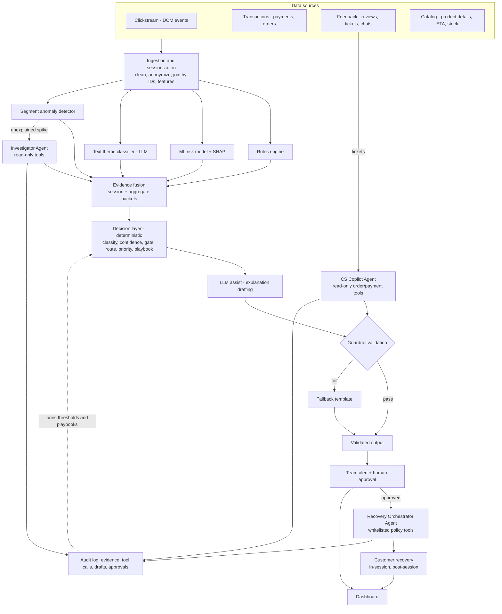

# AI-Powered Customer Journey Friction Detection and Recovery Assistant

**Domain:** Retail / E-commerce · **Problem Statement 4**
**Document:** PRD + System Architecture — **v2 (scoped for a <12-hour build, with bounded agentic AI)**

---

## 0. What changed from v1

| # | Change | Why |
|---|---|---|
| 1 | Added **three bounded AI agents** (Investigator, Recovery Orchestrator, CS Copilot) on one shared agent runtime | Gives the solution real agentic behavior where the path isn't known in advance, without giving up the "system decides, humans approve" principle |
| 2 | **MVP scope cut:** 4 friction types built end to end, post-purchase covered through the CS Copilot, the other 5 are generator-only | 10 types end to end isn't feasible in 12 hours |
| 3 | **Pre-seeded Gateway B spike** in synthetic data | The live demo session has to join an existing aggregate pattern for the "2,000 sessions affected" alert to be real |
| 4 | **Planted "unknown" pattern** + segment anomaly detector + agent investigation | Backs up the claim "AI discovers patterns rules don't know about" |
| 5 | **Confidence formula defined** (§7.5) | Thresholds 0.8 / 0.5 were arbitrary without it |
| 6 | **Grounding check made realistic:** numbers and entities are checked against the evidence packet and agent tool outputs | Checking every "claim" isn't buildable in 12 hours |
| 7 | **Recovery lift vs holdout moved to "production measurement plan"** | On synthetic data, lift is set by us, so it's circular and judges can pick it apart |
| 8 | **Dashboard collapsed** to 3 screens + team filter | Four separate team views are too much for 12 hours |
| 9 | **Open decisions closed:** Streamlit, SQLite, plain HTML storefront, native LLM tool calling (no agent framework) | Every hour spent debating is an hour not building |
| 10 | Added **12-hour build plan**, team split, checkpoints and cut lines | So the team knows what to drop if behind |

---

## 1. One-line summary

Rules and ML **find** friction, **agents investigate** causes and **orchestrate** recovery using read-only and whitelisted tools, deterministic logic **decides**, the LLM **explains** under guardrails, and business teams **approve**. It turns "70% of carts are abandoned" into "who is leaving, why, and what to do about it."

---

## 2. Problem

E-commerce customers abandon purchases because of hidden friction: unclear product information, delivery uncertainty, payment failures, poor recommendations, and post-purchase concerns.

- Businesses see **where** drop-offs happen (funnel reports) but not **why**, or **what action** to take.
- Customer service, marketing, product and operations analyze their slices **separately**, so nobody connects the signals.
- Result: revenue loss, higher support volume, lower loyalty, poor brand perception.

**Gap in existing tools** (Contentsquare, Quantum Metric, FullStory, Glassbox, Amplitude): strong at *where/when* from click behavior; weak at *why*, because they rarely fuse clicks with payments, orders, tickets, reviews and catalog data, and rarely drive team-level recovery workflows. Investigating a new drop-off still needs an analyst to manually query five systems. **Our Investigator Agent does that legwork.**

---

## 3. Goals, non-goals, success metrics

### Goals
1. **Detect** customer journey friction points (session-level and aggregate-level).
2. **Infer likely causes**, with explanations that connect customer behavior to business causes.
3. **Investigate** new or unexplained drop-offs automatically (agentic).
4. **Recommend and orchestrate practical recovery actions** for customers and business teams.
5. Provide **journey risk indicators, recommended interventions, assisted responses, and workflow triggers**.

### Non-goals (MVP)
- Production-scale streaming infrastructure.
- Full session video replay.
- Autonomous agent decisions with side effects: agents never choose the friction type, invent actions, or execute anything outside the pre-approved low-risk list.
- Multi-agent frameworks (LangGraph, CrewAI, etc.). One small tool-calling loop is enough and lower-risk.

### Success metrics (MVP, on synthetic data)
| Metric | Target |
|---|---|
| Detection precision / recall per friction type vs planted ground truth | Reported per type; target ≥ 0.85 on the 4 core types |
| Friction type accuracy | % of flagged sessions assigned the correct type |
| Unknown pattern discovery | Investigator Agent finds the planted hidden pattern (yes/no + steps taken) |
| Guardrail pass rate | % of LLM/agent outputs passing validation on first try |
| Agent grounding rate | % of numbers in agent reports that trace to a logged tool output (target 100%; failures fall back) |
| False-alert rate | % of high-confidence alerts on "clean" sessions |

**Production measurement plan (not claimed in MVP):** recovery lift vs a 10% holdout group, step drop-off before vs after fix.

---

## 4. Users

| User | Needs |
|---|---|
| **Customer service** | At-risk customers, post-purchase issues, AI-drafted replies to approve (CS Copilot) |
| **Marketing** | Abandoned carts by cause, recovery campaign status, price-shock insights |
| **Product** | Products with information gaps, comparison loops |
| **Operations / Tech** | Payment gateway health, delivery-driven drop-off by region, technical errors, new friction candidates |
| **End customer** (indirect) | Timely, relevant help that removes the reason they were stuck |

---

## 5. Friction taxonomy and MVP scope

### 5.1 Tier 1 — built end to end (detection → decision → agent → action → dashboard)

| # | Friction | Detect (behavior signals) | Likely business cause | Customer recovery | Owner team |
|---|---|---|---|---|---|
| 1 | **Payment failures** *(demo hero)* | ≥ 2 failed attempts, method switching, exit after failure, "money deducted" tickets | Gateway/bank/method instability | Suggest a working alternate method, one-tap retry link, refund reassurance | Operations / Tech |
| 2 | **Delivery uncertainty** | Hesitation on delivery step, repeated pincode checks, exit after ETA/fee shown | Long ETA for region, far warehouse | Guaranteed "arrives by" date, express option | Operations |
| 3 | **Unclear product information** | Comparison looping, repeated size-chart/spec opens, review scanning then exit | Missing/vague catalog attributes | Auto comparison table, AI Q&A from specs/reviews | Product |
| 4 | **Hidden costs / price shock** | Exit right after total shown; checkout → cart back-navigation | Late shipping/fee reveal | Show full cost early; free-shipping threshold nudge | Marketing |

**Post-purchase concerns** (problem-statement core type) are covered through the **assisted response path**: "where is my order" / "money deducted" tickets → CS Copilot Agent → drafted reply → human approval.

> Cart abandonment and product comparison behavior are **symptoms** through which these causes appear, not separate friction types.

### 5.2 Tier 2 — generator + rule only (appear in data and taxonomy; no custom playbook UI)

Poor recommendations, coupon failure, forced login / OTP issues, out of stock / size unavailable, technical glitches.

### 5.3 Planted unknown pattern (for agent discovery)

The generator plants one pattern that **no rule targets**: *iOS Safari users hitting an address-form validation error at checkout, then exiting* (~6% of mobile sessions, concentrated in one segment). Only the segment anomaly detector can flag it, and only the Investigator Agent can explain it.

---

## 6. Design principle: bounded autonomy

**Agents investigate and orchestrate. The deterministic layer decides. Humans approve. Every output is validated.**

| Task | Decided by | AI role |
|---|---|---|
| Is there friction? | Rules + ML + anomaly detector | None |
| Which friction type? | Deterministic mapping of rules + ML signals + text themes | LLM classifies **text** into themes only |
| Why did an aggregate spike or unknown pattern happen? | **Investigator Agent** proposes; human confirms | Plans and runs **read-only** queries, writes an evidence-cited report |
| Confidence score | Formula (§7.5) | None; any agent self-rating is ignored |
| Which team? | Fixed routing table | None |
| Priority | Impact formula | None |
| Recovery action | Playbook lookup (whitelist) | None; cannot choose or invent actions |
| How to deliver the action (channel, consent, cap, draft, validate) | **Recovery Orchestrator Agent** within policy tools | Sequences whitelisted tools, handles failures |
| Explanation / customer message / CS reply | Built from evidence | Drafts wording |
| Final approval | Business team (or pre-approved low-risk auto-rules) | None |

**Why agents here, and not everywhere:** agents are used only where the steps aren't known in advance (investigating a new spike means deciding which data to look at next) or where a workflow has branches and failures (consent missing, validation failed). Everything with a known answer stays deterministic.

---

## 7. System architecture

### 7.1 High-level flow



### 7.2 Layer 1 — Data sources
| Source | Content | Captured by |
|---|---|---|
| Clickstream | Page views, clicks, cart actions, hesitation, rage/dead clicks, errors | Lightweight JS tracker |
| Transactions | Payment attempts, failures, gateway, error codes; order and delivery status | Backend logs |
| Feedback | Reviews, support tickets, chat transcripts | Support/review systems |
| Catalog | Product attributes, delivery ETA, stock, price | Product DB |

**Capture strategy:** structured event tracking (not session replay). Interaction signals are computed in the browser and sent as summaries. **Never capture** typed card numbers, passwords or OTPs.

**MVP synthetic data generator must include:**
- ~2,000–5,000 sessions over a simulated 7 days, with Tier 1 and Tier 2 frictions planted and **ground-truth labels**.
- A **Gateway B UPI timeout spike** in the last simulated hour (failure rate ~4× baseline, ~2,000 affected sessions), so the live demo session joins it.
- The **planted unknown pattern** (§5.3), with no label visible to the rules.
- **Noise:** clean converting sessions, overlapping frictions, ambiguous sessions, and some random exits with no cause.
- Tickets and reviews whose text matches the planted causes (e.g. "money got deducted but no order").

### 7.3 Layer 2 — Ingestion and sessionization
- Clean and validate events; hash user identifiers.
- Sessionize (30-minute inactivity rule) and map onto the funnel:
  `Browse → Product → Cart → Checkout → Payment → Order → Post-purchase`
- Join on `session_id`, `user_id`, `product_id`, `order_id`.
- Derived features:

| Feature | Definition |
|---|---|
| Rage clicks | ≥ 3 clicks on the same element within 2 s |
| Hesitation | Step dwell time z-score > 2 vs converters at the same step |
| Loops | PDP A → PDP B → PDP A, or Checkout → Cart → Checkout |
| Retries | Failed payment / coupon / OTP attempts; method switches |
| Info-seeking | Repeated size chart, delivery info, return policy, review opens |
| Error exposure | API/form errors, slow loads, out-of-stock encounters |
| Step exit rate | Sessions ending at a step ÷ sessions reaching it |

### 7.4 Layer 3 — Detection
1. **Rules engine**: known friction, instant and explainable (e.g. `payment_failed ≥ 2 AND exit`).
2. **ML risk model** *(gated: build only if features are ready by hour 5)*: XGBoost on session features predicting abandonment; SHAP gives top signals per session. **Fallback:** weighted rule score + ranked "top signals" list, shown the same way in the UI.
3. **Text theme classifier**: LLM tags tickets/reviews/chats into a fixed theme list (`payment_trust`, `money_deducted`, `delivery_delay`, `size_confusion`, `missing_info`, `hidden_fees`, `other`). Run in batch and cache.
4. **Segment anomaly detector**: for each funnel step, compute exit rate by segment (device × browser × region × gateway × category) over the last hour vs 7-day baseline; flag z-score > 3. If **no rule explains** the flagged segment, it becomes a **"new friction candidate"** and triggers the Investigator Agent.

### 7.5 Layer 4–5 — Evidence fusion and decision layer (deterministic)

Evidence fusion produces one **evidence packet** per session and one **aggregate packet** per flagged segment (§8.2).

**1. Friction classification**: fixed mapping from rule flags + top signals + text themes to a friction type. Overlaps get a primary and secondary type, ranked by confidence.

**2. Confidence score (defined):**

```
confidence = 0.35 × rule_fired
           + 0.30 × ml_agrees        (risk ≥ 0.7 AND top SHAP signal maps to the same type)
           + 0.20 × text_agrees      (share of linked feedback with a matching theme, 0–1)
           + 0.15 × aggregate_confirms (session belongs to a flagged segment)
```

| Detectors agreeing | Confidence | Gate |
|---|---|---|
| Rule only | 0.35 | Low: log only |
| Rule + ML | 0.65 | Medium: alert "needs review", no automatic actions |
| Rule + ML + aggregate (+ partial text) | ≥ 0.80 | High: alert with workflow ready |

**3. Routing**: fixed friction → team table (§5.1).
**4. Priority**: impact = cart value at risk × sessions affected × trend (rising = 1.5, flat = 1.0) → Critical / High / Normal by fixed cut-offs.
**5. Recovery action**: playbook lookup (approved actions only), for both customer and team.

### 7.6 Layer 6 — Agentic layer (bounded)

All three agents run on **one shared runtime**: a ~100-line loop using the LLM provider's native tool calling. Each agent is just a config: system prompt + allowed tools + output schema.

**Runtime guardrails (apply to every agent):**
- **Step cap:** max 8 tool calls per run; 45 s timeout.
- **Tool whitelist:** an agent can only call tools in its config. Read-only by default.
- **Side-effect tools** (send, create ticket) are wrapped by deterministic policy checks and only run for pre-approved low-risk actions or after human approval.
- **Every tool call and result is logged** with an ID. Agent outputs must cite tool-call IDs as evidence.
- **Structured output:** Pydantic schema; invalid output → one retry → fallback template.
- **Trace is visible** in the dashboard (the tool calls stream in as the agent works).

#### Agent 1 — Investigator Agent *(must-have; demo hero)*
- **Triggers:** (a) a new friction candidate from the anomaly detector; (b) "Investigate" button on any aggregate alert; (c) a free-text question in the dashboard ("Why did payment drop-off rise in the last hour?").
- **Tools (read-only):**

| Tool | Returns |
|---|---|
| `query_funnel(step, window, filters)` | Reach/exit counts and rates |
| `compare_segments(step, dimension, window)` | Exit rate by segment vs baseline |
| `get_payment_stats(gateway, method, window)` | Attempts, failure rate, error codes |
| `get_delivery_stats(region, window)` | ETA, fee, exit rate after ETA shown |
| `sample_sessions(filters, n)` | Evidence packets of example sessions |
| `search_feedback(theme or keywords, filters)` | Matching tickets/reviews with themes |
| `get_product(product_id)` | Catalog attributes, missing fields |

- **Output (`InvestigationReport`):** hypothesis, supporting evidence (each with tool-call ID), alternative causes checked and ruled out, suggested friction type (from taxonomy or `new_friction`), suggested team. Suggestions are **advisory**: the decision layer recomputes type/confidence; a `new_friction` result goes to a human as "needs playbook."
- **Demo example:** flagged segment = checkout exits on iOS Safari → agent calls `compare_segments(browser)` → `sample_sessions(ios_safari, checkout_exit)` → sees `address_form_error` → `search_feedback("address")` → finds "can't enter my address" tickets → report: "New friction: address form validation fails on iOS Safari; 6% of mobile checkouts affected; not related to payment (checked Gateway stats)."

#### Agent 2 — Recovery Orchestrator Agent *(should-have)*
- **Trigger:** a team member approves an alert, or a pre-approved low-risk playbook action fires.
- **Input:** evidence packet + decided friction type + playbook action (it cannot change these).
- **Tools:** `check_consent(user)`, `check_frequency_cap(user)`, `get_channel_prefs(user)`, `draft_message(template_id, evidence)`, `validate_message(text)`, `queue_for_approval(item)`, `send_message(channel, text)` *(only pre-approved low-risk: retry link, back-in-stock, delivery-date info)*, `create_ticket(team, summary)`.
- **What makes it agentic:** it plans the delivery and handles branches: e.g. WhatsApp not opted in → falls back to email; validation fails → redrafts once → fallback template; cart value above threshold → routes to CS for human approval instead of sending.
- **Cut line:** if behind schedule, implement as a fixed deterministic pipeline with one LLM drafting step. The demo still works.

#### Agent 3 — CS Copilot Agent *(must-have; small)*
- **Trigger:** a new support ticket (e.g. "money deducted, order not placed").
- **Tools (read-only):** `get_order(order_id)`, `get_payment_attempts(session_id)`, `get_refund_status(payment_id)`, `get_policy(topic)`.
- **Output:** drafted reply grounded in actual order/payment status + policy, a suggested internal note, and the linked friction type. Goes to the CS inbox with **Approve / Edit / Reject**. Covers **assisted responses** and **post-purchase concerns**.

### 7.7 Layer 7 — LLM explanation drafting
- **Input:** evidence packet (+ investigation report if one exists) + decided friction type and action.
- **Output:** fixed JSON (§8.3): summary, behavior observed, likely business cause, evidence used.
- **Not allowed:** choosing actions, changing friction type, adding facts, promising refunds or discounts.

### 7.8 Layer 8 — Guardrail validation (applies to LLM and all agent outputs)
| Check | Rule (buildable in MVP) |
|---|---|
| Schema | Pydantic validation; all fields present |
| Numeric grounding | Every number in the text (regex) must appear in the evidence packet or a logged tool result |
| Entity grounding | Every gateway, region, product ID, method named must exist in the evidence/tool results |
| Consistency | Mentioned friction type and action match the decided ones |
| Policy | Banned-phrase list (refund promises, unapproved discounts), no PII patterns (email/phone/card regex), tone check by LLM (optional) |

**On failure:** one redraft → otherwise a pre-written **fallback template**. The system never depends on the LLM behaving.

### 7.9 Layer 9 — Actions
**Team alerts (aggregate path):** friction type, confidence, priority, validated explanation, key evidence, recommended action, and buttons **Approve · Investigate · Create ticket · Dismiss**. Approve hands off to the Recovery Orchestrator.

**Customer recovery (session path):**
| Moment | Channel | Example |
|---|---|---|
| In-session | Banner on storefront | "UPI seems slow — pay by card or COD. Your cart is saved." |
| Post-session | WhatsApp / email (simulated) | One-tap retry link |
| Post-purchase | Assisted CS reply | "Your payment of ₹2,499 was not captured; any amount held is released within 5–7 days." |

Rules: fix the cause first; discounts only when the cause is price; frequency caps; opted-in channels only; high-value carts or angry customers go to CS for human approval.

### 7.10 Layer 10 — Dashboard (Streamlit, 3 screens + team filter)
1. **Overview:** funnel with drop-off heatmap, top frictions by revenue at risk, friction health (normal / rising / critical), new friction candidates.
2. **Live feed + alerts:** at-risk sessions (auto-refresh every 2–3 s) and the alert inbox, with a **team filter** (CS / Marketing / Product / Ops). Clicking an alert opens the explanation, evidence, **agent trace**, and action buttons.
3. **Ask & Investigate:** free-text question box → Investigator Agent run with a streamed tool trace → report. Also contains the CS Copilot inbox.

### 7.11 Layer 11 — Audit and feedback loop
- Log evidence, confidence, every agent tool call and result, LLM drafts, validation result, approver, action executed.
- MVP shows the **audit log** and **evaluation report** (precision/recall vs ground truth, guardrail pass rate, agent grounding rate).
- Production plan: holdout group and outcome tracking tune thresholds and playbooks.

---

## 8. Data schemas

### 8.1 Event
```json
{
  "session_id": "s_1042",
  "user_id": "u_88_hashed",
  "timestamp": "2026-09-30T11:02:14",
  "event": "payment_failed",
  "page": "checkout_payment",
  "product_id": "p_311",
  "order_id": null,
  "metadata": { "method": "UPI", "gateway": "B", "error": "timeout", "cart_value": 2499, "device": "android", "browser": "chrome", "region": "KA" }
}
```

### 8.2 Evidence packet
```json
{
  "session_id": "s_1042",
  "risk_score": 0.82,
  "rule_flags": ["payment_retry_x2"],
  "top_signals": ["upi_timeout", "method_switch"],
  "text_themes": ["money_deducted"],
  "text_agreement": 0.6,
  "aggregate_context": { "segment": "gateway=B,method=UPI", "failure_rate_multiplier": 4.0, "affected_sessions": 2000 },
  "friction_type": "payment_failure",
  "secondary_friction": null,
  "confidence": 0.92,
  "priority": "critical",
  "owner_team": "operations_tech",
  "playbook_action": { "customer": "alternate_method_and_retry_link", "team": "check_or_switch_gateway" }
}
```
*(confidence = 0.35 + 0.30 + 0.20 × 0.6 + 0.15 = 0.92)*

### 8.3 LLM explanation output (validated)
```json
{
  "summary": "Payment-step drop-off rose sharply due to UPI timeouts on Gateway B.",
  "behavior_observed": "Two failed UPI attempts followed by exit.",
  "likely_business_cause": "Gateway B instability, not price.",
  "evidence_used": ["upi_timeout", "failure_rate_multiplier", "affected_sessions"]
}
```

### 8.4 Investigation report (agent output, validated)
```json
{
  "trigger": "anomaly:checkout_exit:browser=ios_safari",
  "hypothesis": "Address form validation fails on iOS Safari, causing checkout exits.",
  "evidence": [
    { "claim": "Checkout exit rate on iOS Safari is 31% vs 9% baseline", "tool_call_id": "tc_2" },
    { "claim": "18 of 20 sampled exits had address_form_error", "tool_call_id": "tc_3" },
    { "claim": "7 tickets mention being unable to enter an address", "tool_call_id": "tc_4" }
  ],
  "ruled_out": [
    { "cause": "payment_failure", "reason": "Gateway failure rates normal for this segment", "tool_call_id": "tc_5" }
  ],
  "suggested_friction_type": "new_friction",
  "suggested_team": "operations_tech",
  "steps_used": 5
}
```

### 8.5 Team alert
```
CRITICAL — Payment failure (confidence 0.92) → Operations/Tech
Payment-step drop-off rose from 8% to 19% in the last hour. 90% of failures are
UPI timeouts on Gateway B, affecting ~2,000 sessions (₹4.2L cart value).
Recommended: Route UPI traffic to Gateway A; send retry links to affected customers.
[Approve] [Investigate] [Create ticket] [Dismiss]
```

---

## 9. MVP deliverables (prioritized)

| Priority | Deliverable |
|---|---|
| **Must** | Synthetic data generator (Tier 1 + Tier 2 frictions, Gateway B spike, planted unknown pattern, noise, ground truth) |
| **Must** | Ingestion + features + rules engine + segment anomaly detector |
| **Must** | Decision layer (classification, confidence formula, gating, routing, priority, playbooks) |
| **Must** | Shared agent runtime + **Investigator Agent** + **CS Copilot Agent** |
| **Must** | Explanation drafting + guardrail validator + fallback templates |
| **Must** | Mock storefront (product → cart → checkout, "simulate Gateway B failure" toggle) + JS tracker |
| **Must** | Streamlit dashboard: Overview, Live feed + alerts, Ask & Investigate |
| **Should** | Recovery Orchestrator Agent (else deterministic pipeline) |
| **Should** | Text theme classifier (batch, cached) |
| **Could** | XGBoost + SHAP (else weighted rule score + top signals) |
| **Could** | Evaluation report page; audit log viewer |
| **Post-MVP** | Tier 2 playbooks, holdout lift measurement, Markov impact analysis, React UI, streaming infra |

---

## 10. Tech stack (decided)

| Area | Choice |
|---|---|
| Language | Python 3.11 |
| Data generation | pandas, Faker, numpy |
| Backend / APIs | FastAPI (also serves the storefront and receives tracker events) |
| Storage | SQLite |
| ML (optional) | XGBoost, SHAP, scikit-learn |
| LLM | Whichever provider the team already has a key for; **must support native tool calling** |
| Agents | Own ~100-line tool-calling loop; no framework |
| Validation | Pydantic + regex grounding checks |
| Dashboard | Streamlit (auto-refresh for live feed) |
| Storefront | Plain HTML + vanilla JS tracker |

---

## 11. Build plan (<12 hours, 4 people)

| Hours | P1 — Data & detection | P2 — Backend & decision | P3 — Agents & LLM | P4 — UI & demo |
|---|---|---|---|---|
| 0–1 | **All:** freeze schemas (§8), friction list, tool signatures, repo layout | | | |
| 1–4 | Synthetic generator with spike, planted pattern, noise, labels | FastAPI skeleton, SQLite, event ingest, storefront + tracker | Agent runtime loop, tool stubs on fixture data, Pydantic schemas | Streamlit skeleton for 3 screens on mock JSON |
| 4–7 | Features, rules, anomaly detector; ML only if on track at hour 5 | Evidence fusion, confidence, routing, priority, playbooks | Investigator + CS Copilot on real data; explanation drafting; validator + fallbacks | Wire dashboard to APIs, alert cards, agent trace view |
| **7** | **Checkpoint:** live payment failure appears in feed with explanation. If not, cut Orchestrator, ML and text classifier. | | | |
| 7–9 | Text theme classifier (cached); eval report | Integration and bug fixing | Recovery Orchestrator (or deterministic fallback) | Storefront banner, message preview, CS inbox |
| 9–10 | **All:** end-to-end run of the demo path, twice | | | |
| 10–12 | **Feature freeze.** Cache agent runs for the demo, record a backup video, build slides, rehearse | | | |

---

## 12. Demo flow (~6 minutes)

1. **Journey overview**: funnel heatmap, top frictions by revenue at risk.
2. **Live friction**: on the mock storefront, fail a UPI payment twice.
3. **Detection**: session appears in the live feed with risk score, friction type and confidence; storefront shows the alternate-payment banner.
4. **Root cause**: critical Gateway B alert. Click **Investigate** → Investigator Agent's tool calls stream in → report confirms Gateway B, rules out price.
5. **Approve**: Ops approves → Recovery Orchestrator checks consent (WhatsApp not opted in → email), drafts, validates, sends retry link. Show message preview and audit entry.
6. **Assisted response**: a "money deducted" ticket arrives → CS Copilot looks up the payment → drafted reply → Approve.
7. **Unknown friction** *(the wow moment)*: "New friction candidate" on the overview → agent investigates → discovers the iOS Safari address-form bug that no rule was written for → routed as "needs playbook."
8. **Proof**: precision/recall vs planted ground truth, guardrail pass rate, agent grounding rate, and a note on how we'd measure recovery lift in production.

---

## 13. Problem statement coverage

| Problem statement asks for | Covered by |
|---|---|
| Detect journey friction | Layers 2–3 (rules, ML, anomaly detector) |
| Infer likely causes | Decision layer + Investigator Agent |
| Explanations connecting behavior to business causes | Explanation drafting + investigation reports, both validated |
| Practical recovery actions | Playbooks + Recovery Orchestrator |
| Journey risk indicators | Risk score, confidence, priority, funnel heatmap |
| Recommended interventions | Playbook actions in alerts |
| Assisted responses | CS Copilot Agent + customer messages |
| Workflow triggers | Alert buttons → Orchestrator → tickets/messages |
| Combine behavior, transactions, feedback, product metadata, service interactions | Layer 1–2 joins, evidence fusion, agent tools that span all sources |
| Sessionize, anonymize, classify feedback, clean sequences | Layer 2 + text theme classifier |
| Synthetic data for abandonment, comparison, payment issues, recovery | Synthetic data generator |
| Mix of prediction, reasoning, personalization and automation | ML risk model, agents, personalized messages, orchestrated workflows |

---

## 14. Key talking points

- **Understanding:** "Businesses know *where* customers drop off, but not *why*, because the evidence is split across teams. We connect it to detect friction, explain the cause, and recommend recovery."
- **Why AI:** "Rules catch known friction. ML predicts drop-off. Agents investigate the drop-offs nobody wrote a rule for, doing in seconds what an analyst does across five systems."
- **Why bounded agents:** "Our agents can look at anything but touch almost nothing. They query read-only tools, cite every number they use, and anything with side effects needs a human or a pre-approved rule."
- **LLM stance:** "The system decides and humans approve. Every word the AI writes is checked against evidence before anyone sees it."
- **Recovery:** "We don't send generic reminders; we fix the specific reason the customer left, through a channel they opted into."
- **Dashboards:** "One shared source of truth to break silos, with each team seeing only what they can act on."

---

## 15. Risks and mitigations

| Risk | Mitigation |
|---|---|
| Synthetic data too clean → unrealistic accuracy | Noise, overlapping frictions, ambiguous sessions, random exits |
| ML just re-learns our planted rules | Say so openly; position ML as the production path and the anomaly detector + agent as the discovery path |
| Agent loops, slow or wanders | 8-step cap, 45 s timeout, narrow tool set; cache demo runs; fallback to a recorded trace |
| Agent invents facts or actions | Read-only/whitelisted tools, tool-call citations, numeric/entity grounding, fallback templates |
| Live demo breaks | Cached agent outputs, seeded database snapshot, backup video |
| Alert fatigue | Confidence gating, priority scoring, digests |
| Privacy | No sensitive input capture, hashed IDs, PII regex in validator |
| Overlapping frictions in one session | Primary + secondary type ranked by confidence |
| Running behind schedule | Cut lines in §9 and the hour-7 checkpoint |

**Remaining open items for the team:** confirm LLM provider/key; assign P1–P4; confirm deliverable format (demo only vs demo + slides + repo).
